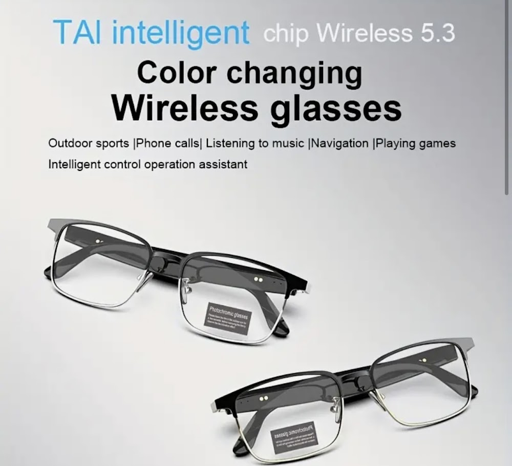

# Quick Reference Guide - AutoVision Initiative

## 🎨 Color Classes (Tailwind)

```html
<!-- Backgrounds -->
bg-dark-navy       <!-- #0f1923 - Dark navy blue -->
bg-deep-blue       <!-- #1a2332 - Deep blue -->
bg-bright-orange   <!-- #FF9900 - Orange accent -->
bg-cyan-bright     <!-- #00d4ff - Cyan highlight -->

<!-- Text Colors -->
text-dark-navy
text-deep-blue
text-bright-orange
text-cyan-bright
```

---

## 📱 Responsive Classes Quick Reference

```html
<!-- Hidden on mobile, visible on desktop -->
class="hidden md:block"

<!-- Visible on mobile, hidden on desktop -->
class="block md:hidden"

<!-- Responsive text sizes -->
class="text-base sm:text-lg md:text-xl lg:text-2xl"

<!-- Responsive padding -->
class="p-4 sm:p-6 md:p-8 lg:p-10"

<!-- Responsive grid columns -->
class="grid-cols-1 md:grid-cols-2 lg:grid-cols-3"
```

---

## 🔧 Common Modifications

### Change Button Color
```html
<!-- Orange button -->
<button class="bg-bright-orange hover:bg-orange-600">Click Me</button>

<!-- Dark button -->
<button class="bg-dark-navy hover:bg-deep-blue">Click Me</button>
```

### Add Hover Effects
```html
<!-- Scale on hover -->
class="hover:scale-105 transition-transform"

<!-- Shadow on hover -->
class="hover:shadow-xl transition-shadow"

<!-- Brightness on hover -->
class="hover:brightness-110 transition-all"
```

### Rounded Corners
```html
class="rounded-lg"     <!-- Small -->
class="rounded-xl"     <!-- Medium -->
class="rounded-2xl"    <!-- Large -->
class="rounded-3xl"    <!-- Extra Large -->
class="rounded-full"   <!-- Pill shape -->
```

---

## 📐 Spacing Scale

```
p-1  = 0.25rem (4px)
p-2  = 0.5rem  (8px)
p-4  = 1rem    (16px)
p-6  = 1.5rem  (24px)
p-8  = 2rem    (32px)
p-10 = 2.5rem  (40px)
p-12 = 3rem    (48px)
```

Same applies to: `m-` (margin), `px-` (horizontal), `py-` (vertical)

---

## 🖼️ Image Replacement

### Step 1: Add your image to the img folder
```
img/
├── hero-background.jpg
├── service-eye.jpg
├── service-glasses.jpg
└── glasses-1.jpg
```

### Step 2: Update the HTML
```html
<!-- Old -->


<!-- New -->

```

---

## 🎯 Section IDs for Navigation

```html
#services    <!-- Services Section -->
#gallery     <!-- Smart Glasses Collection -->
#eligibility <!-- (Add this section) -->
#faq         <!-- (Add this section) -->
```

---

## 📝 Adding a New Section

```html
<!-- Copy this template -->
<section id="your-section-id" class="py-16 sm:py-20 bg-white">
  <div class="max-w-7xl mx-auto px-4 sm:px-6 lg:px-8">
    <!-- Section Header -->
    <div class="text-center mb-12">
      <h2 class="text-3xl sm:text-4xl lg:text-5xl font-bold text-gray-900 mb-4">
        Your Section Title
      </h2>
      <p class="text-lg text-gray-600 max-w-2xl mx-auto">
        Your section description
      </p>
    </div>
    
    <!-- Your content here -->
    
  </div>
</section>
```

---

## 🔗 Link Styles

```html
<!-- Navigation Link -->
<a href="#" class="text-gray-700 hover:text-gray-900 transition-colors">Link</a>

<!-- Button Link (Orange) -->
<a href="#" class="px-6 py-2 bg-bright-orange text-white rounded-full hover:bg-orange-600 transition-colors">
  Button Link
</a>

<!-- Button Link (Dark) -->
<a href="#" class="px-6 py-2 bg-dark-navy text-white rounded-full hover:bg-deep-blue transition-colors">
  Button Link
</a>
```

---

## 📊 Grid Layouts

### 2 Column Grid
```html
<div class="grid grid-cols-1 md:grid-cols-2 gap-6">
  <div>Column 1</div>
  <div>Column 2</div>
</div>
```

### 3 Column Grid
```html
<div class="grid grid-cols-1 md:grid-cols-3 gap-6">
  <div>Column 1</div>
  <div>Column 2</div>
  <div>Column 3</div>
</div>
```

### 4 Column Grid (Gallery)
```html
<div class="grid grid-cols-2 md:grid-cols-3 lg:grid-cols-4 gap-4">
  <!-- Items -->
</div>
```

---

## 🎭 Shadow Classes

```html
shadow-sm    <!-- Small shadow -->
shadow       <!-- Default shadow -->
shadow-md    <!-- Medium shadow -->
shadow-lg    <!-- Large shadow -->
shadow-xl    <!-- Extra large shadow -->
shadow-2xl   <!-- 2X large shadow -->
```

---

## 💡 Common Patterns

### Card with Image
```html
<div class="bg-white rounded-3xl shadow-lg overflow-hidden">
  
  <div class="p-6">
    <h3 class="text-2xl font-bold mb-3">Title</h3>
    <p class="text-gray-600 mb-6">Description</p>
    <button class="w-full py-3 bg-dark-navy text-white rounded-full">
      Action
    </button>
  </div>
</div>
```

### Stat Card (Glass Effect)
```html
<div class="bg-white bg-opacity-10 backdrop-blur-md rounded-2xl p-6 border border-white border-opacity-20">
  <div class="text-5xl font-bold text-white mb-2">100+</div>
  <div class="text-gray-200">Label</div>
</div>
```

---

## 🚀 Testing Checklist

- [ ] Test on mobile (320px - 640px)
- [ ] Test on tablet (640px - 1024px)
- [ ] Test on desktop (1024px+)
- [ ] Check all links work
- [ ] Verify mobile menu opens/closes
- [ ] Test smooth scrolling
- [ ] Check all images load
- [ ] Verify forms still work (join.html, provider.html)

---

## 📱 Mobile Menu

The mobile menu automatically:
- Shows on screens < 768px
- Toggles with hamburger button
- Closes when clicking a link
- Changes icon from ☰ to ✕

No additional code needed!

---

## 🎨 Customizing Colors

Edit the Tailwind config in `index.html` (lines 11-25):

```javascript
tailwind.config = { 
  theme: { 
    extend: { 
      colors: { 
        'deep-blue': '#1a2332',      // Change these hex values
        'dark-navy': '#0f1923',
        'bright-orange': '#FF9900',
        'cyan-bright': '#00d4ff',
      }
    }
  }
}
```

---

**Pro Tip**: Use browser DevTools (F12) to test responsive designs and experiment with Tailwind classes in real-time!
